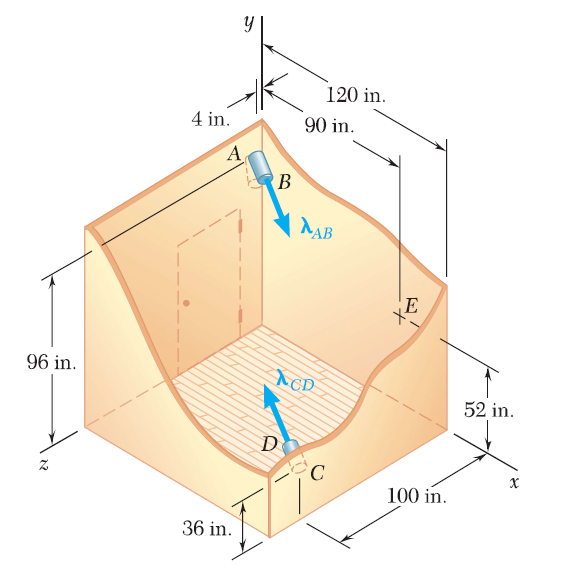

**3.C6** Two cylindrical ducts, AB and CD, enter a room through two parallel walls. The centerlines
of the ducts are parallel to each other but are not perpendicular to the walls. The ducts are to be
connected by two flexible elbows and a straight center portion. Write a computer program that can be
used to  determine the lengths of AB and CD that minimize the distance between the axis off the
straight portion and a thermometer mounted on the wall at E. Assume the elbows are of negligible 
length anf that AB and CD have centerlines defines by _λ\_ab = (7i -4j +4k)/9_ and _λ\_cd = (-7i + 4j -4k)/9_
and can vary in length from 9 in. to 36 in. 
